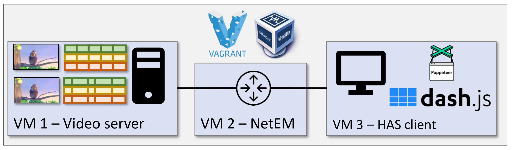
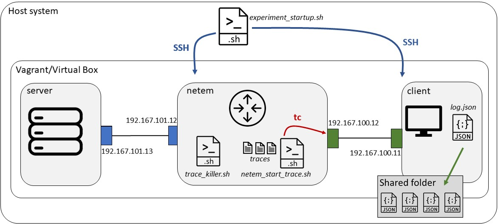

# DASH-streaming-setup
Setup used for the video streaming experiments in the MMSys'20 Paper "Comparing Fixed and Variable Segment Durations for Adaptive Video Streaming – A Holistic Analysis". 
## Overview 
The setup consists of three virtual machines. 
   * The __server__, which hosts the video content 
   * The __netem__, which throttles the bandwidth, as for example defined by traces 
   * The __client__, which uses DASH.js to stream the video
   


## Requirements
The setup has been tested for the following operating systems and Vagrant versions: 
   * Windows 10 - Vagrant 2.2.6
   * Debian 9.12 (stretch) - Vagrant 2.0.2
   
In general, the setup should be runnable on any current platform having Vagrant installed. However, due to the virtualization, it cannot be run in a virtual envrionment (e.g. on a server VM). 


## Using the setup for video streaming measurements 
__Step 1__ Open a terminal and navigate into the subfolder *vagrant_files*. Run the following command to provision all VMs (this might take a few minutes).
```
vagrant up
```
All VMs are ready as soon as you can see the following output: 
```
[nodemon] starting node ./bin/www
```

__Step 2__ Open a second terminal and navigate again into the subfolder *vagrant_files* 

   * __Case 1: Performing a single measurement run__: Log in to the client VM by typing the following command: 
```
   vagrant ssh client 
```   
On the client VM, change the directory using 
```
cd /home/vagrant/DASH-setup/fetcher
```
In this directory, a measurment run can be initiated with the following command: 
```
npm start $browserDIr $run_var $videoDir $host
```
With the parameters being as follows. 
   * browserDir: A directory located at the client, where Chrome settings and log files are stored
   * run_var: A unique name for the experiment run
   * videoDir: Server-sided path for video to be streamed 
   * host: IP address of the server
   
Then, a single run can for exmaple be initiated as follows: 
```
npm start '/home/vagrant/browserDir' 'test_run' 'CBR_BBB_NA_10/playlist.mpd' '192.167.101.13'
```   

   * __Case 2: Performing a set of measurement runs using the automation script__: Adapt the file *experiment_startup.sh* according to your needs (more detail on the script can be found below). From the *vagrant_files* directory, run the following command from your host machine:
```
bash experiment_startup.sh
```


__Step 3__ As soon as a measurment run is finished, the log file can be found in the following directory on the host machine: *DASH-setup/client/logs*. 

__Step 4__ To destroy all VMs for clean up, run: 
``` 
vagrant destroy
```

## Detailed description 

Running __vagrant up__ on the host machine automatically provisions server, netem, and client. The configurations for these machines can be changed in the *Vagrantfile*, as well as in the respective provisioning scripts *setup_server.sh*, *setup_netem.sh*, and *setup_client.sh*. Running *experiment_startup.sh* initiates the automatized measurements. 
   * __line 4__ -- allows to specify the number of runs to be performed for each trace
   * __line 17__ ```vagrant ssh netem -- -t bash trace_killer.sh ``` -- ensures that no old traces, e.g. from previous measurement runs, ar active. The script *trace_killer.sh* is located at the netem. Via the SSH command, the host machine triggers the netem to perform the cleanup. 
   * __line 20__ ```vagrant ssh netem -- -t timeout 1500s bash netem_start_trace.sh trace_files/$trace_folder/$tr &```-- Via SSH, the host machine triggers the netem to start limiting the bandwidth according to the values specified in the trace file using linux traffic control (tc).
   * __line 23__ ```vagrant ssh client -- -t "(cd /home/vagrant/DASH-setup/client && timeout $vid_timeout npm start $browserDir $run_var $videoDirVAR $host)" ``` -- Via SSH, the client is pushed to start the video stream with the the specified parameters. The process is started so to quit after the time specified in $vid_timeout. This is to ensure that if any error occurs during a run (e.g. a timeout event from DASH.js or 404 error), the measurement procedure does not get stuck. 

As soon as one video has been streamed completely, the client stores the .json log file in a folder which is shared with the host machine. 


## Customizing the setup 
We describe in the following, how the setup can be customized. 
### ABR and buffer thresholds
To adapt ABR and buffer thresholds, navigate to *DASH-setup/server/public/javascripts*. Open the file *player.js* to modify the parameters in line 20: 
```
player.updateSettings({'streaming': {stableBufferTime: 30, bufferTimeAtTopQuality: 45, abr:{ABRStrategy: 'abrDynamic'}}});
```
DASH.js provides three different ABR Strategies: 
  * abrDynamic (default, hybrid solution)
  * abrBolda (buffer-based)
  * abrThroughput (rate-based)
  
Please find more information regarding different buffer threshold settings and other player/ABR settings here: http://cdn.dashjs.org/latest/jsdoc/module-Settings.html#~StreamingSettings__anchor

### Using own bandwidth traces or videos
  * Traces: The automation srcipt *experiment_startup.sh* performs measurement runs for all available traces in the specified trace folder. Hence, if measurements should be run with a specific set of traces, these traces simply need to be put into the respective directory here: *vagrant_files/trace_files*.
  * Videos: All test videos, which are located in the folder *DASH-setup/public/videos*, will be available for streaming at the server. In our setup, we used the following structure for the video sequences. 
```
videos
|
|_____CBR_BBB_VAR_10
|     |     playlist.mpd
|     |_____quality_0
|     |     |     quality0.mpd
|     |     |     init_stream0.m4s
|     |     |     chunk1.m4s
|     |     |     chunk2.m4s
|     |     |     chunk3.m4s
|     |       
|     |_____quality_1
|     |     |     quality1.mpd
|     |     |     init_stream1.m4s
|     |     |     chunk1.m4s
|     |     |     chunk2.m4s
|     |     |     chunk3.m4s
|     |
|     |_____quality_2
|     |     |     quality2.mpd
|     |     |     init_stream2.m4s
|     |     |     chunk1.m4s
|     |     |     chunk2.m4s
|     |     |     chunk3.m4s
|
|_____CBR_BBB_NA_10
|     |     playlist.mpd
|     |_____quality_0
|     |     |     quality0.mpd
|     |     |     init_stream0.m4s
|     |     |     chunk1.m4s
|     |     |     chunk2.m4s
|     |     |     chunk3.m4s
|     |       
|     |_____quality_1
|     |     |     quality1.mpd
|     |     |     init_stream1.m4s
|     |     |     chunk1.m4s
|     |     |     chunk2.m4s
|     |     |     chunk3.m4s
|     |
|     |_____quality_2
|     |     |     quality2.mpd
|     |     |     init_stream2.m4s
|     |     |     chunk1.m4s
|     |     |     chunk2.m4s
|     |     |     chunk3.m4s

```
  
  
### Using a fixed bandwidth instead of traces
During the measurement runs, the bandwidth is automatically throtteled at the netem according to the values specified in the trace files. However, if the bandwidth should be kept fix, please follow these steps: 

__Step 1__: Log in to the netem
``` 
vagrant ssh netem 
```
__Step 2__: Add the queueing discipline (qdisc) on the interface eth2
```
sudo tc qdisc add dev eth2 root handle 1: htb default 1
```
__Step 3__: Set the bandwidth limit, expressed as kbps, on eth2:
```
sudo tc class add dev eth2 parent 1: classid 1:1 htb rate 1000kbit
```

## Links/References
  * The measurements are performed using the DASH reference client implementation DASH.js https://github.com/Dash-Industry-Forum/dash.js?
  * Puppeteer was used to allow the usage of DASH.js within the Chrome Browser in headless mode https://github.com/puppeteer/puppeteer
  * The QoE is evaluated according to the standardized ITU-T P.1203 model https://github.com/itu-p1203/itu-p1203
  
## Contact
If you experience problems or have any questions on the measurement setup, please contact Susanna Schwarzmann (susanna@inet.tu-berlin.de)

